# Hi, I'm Caio Jannuzzi 👋

### Civil Engineer • University Professor • Technology Enthusiast

## About me

I am a Civil Engineer and university professor at [Universidade de Vassouras](https://www.univassouras.edu.br/), working at the intersection of engineering, education, safety, and software development.

My current interests include technology applied to engineering workflows, educational software, backend development, data and automation, information security, and practical ways to make technical work clearer and more efficient.

I am also pursuing postgraduate studies in Railway Engineering and enjoy translating complex subjects into simple, useful learning experiences.

- 🇧🇷 Based in Rio de Janeiro, Brazil
- 🎓 Teaching Algorithms, Computational Thinking, Web Development, Backend Development, and Data Structures
- 🧩 Building educational and engineering-focused tools
- 🐳 Exploring Linux, Docker, automation, and privacy-first client-side applications
- 🤝 Open to collaborations in education, engineering technology, backend, data, and machine learning
- ✉️ [Get in touch](mailto:caio.jannuzzi@outlook.com)

## What I build

| Area | Interests and projects |
| --- | --- |
| Education | Learning resources, programming laboratories, and tools for future software engineers |
| Engineering | Digital workflows, technical communication, safety, and applied computing |
| Software | Python, Django, JavaScript, backend services, automation, and client-side utilities |
| Infrastructure | Linux, Docker, development environments, and reproducible workflows |
| Data & AI | Data science, machine learning, visualization, and responsible use of AI |

## Tech stack

  

## Featured work

### [Explore my repositories](https://github.com/cjannuzzi?tab=repositories)

Educational and engineering-focused experiments connecting software development with real-world workflows, including programming materials, browser-based utilities, automation, data, and technical communication.

## GitHub activity

  
  

  

## Contribution journey

  

### Thanks for visiting!

Feel free to explore the repositories, connect on LinkedIn, or reach out about a project.

